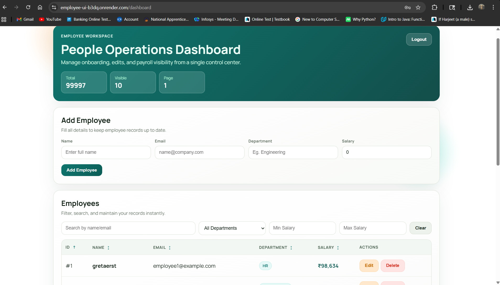
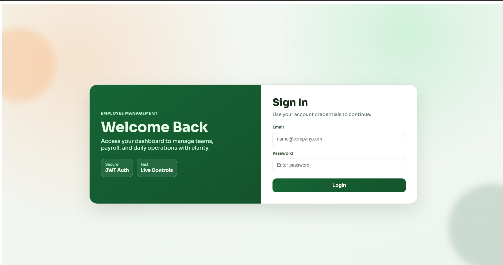

# 🚀 Employee Management System (Angular + .NET)

A production-ready Employee Management Dashboard built with Angular and integrated with a .NET backend API. Designed for real-world business use and freelance client projects.

---

## 🌐 Live Demo

🔗 https://employee-ui-b3dq.onrender.com

**Demo Credentials:**

* Email: [test@example.com](mailto:test@example.com)
* Password: 123456

⚠️ Note: First load may take 20–30 seconds due to server cold start (Render free tier)

---

## 💼 What This Project Solves

This application helps businesses:

* Manage employee data efficiently
* Perform CRUD operations with a clean UI
* Filter and search records instantly
* Handle authentication securely
* Use a scalable dashboard for admin workflows

---

## ✨ Key Features

* 🔐 JWT Authentication with protected routes
* ➕ Add / ✏️ Update / ❌ Delete employees
* 🔍 Search & advanced filtering (name, email, department, salary)
* 📊 Pagination for large datasets
* ↕️ Column sorting
* 💰 Salary formatted in currency
* 📱 Fully responsive UI
* 🔔 Toast notifications for user feedback

---

## 🧠 Built With

* Angular (Standalone Components)
* TypeScript
* ngx-toastr
* REST API integration
* Render (deployment)

---

## 🔗 Backend Integration

Production API:
https://employee-11.onrender.com/api

---

## 📸 Screenshots

Dashboard:


Login:


---

## ⚙️ Local Setup

```bash
git clone <repo-url>
cd employee-ui
npm install
npm start
```

Open: http://localhost:4200

---

## 🚀 Freelance-Ready Capabilities

This project can be extended for:

* Admin / Manager role-based dashboards
* Attendance tracking
* Payroll systems
* Reports & analytics
* Custom business workflows

---

## 💬 Client Pitch

"I can build a modern admin dashboard for your business with authentication, data management, filtering, and scalable UI using Angular and .NET. I’ve already built and deployed a working system — I can customize it to your needs quickly."

---

## 👨‍💻 Author

Built as a production-style portfolio project to demonstrate real-world full-stack development and freelance readiness.
